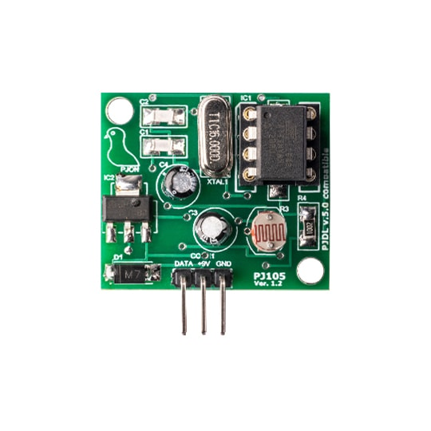
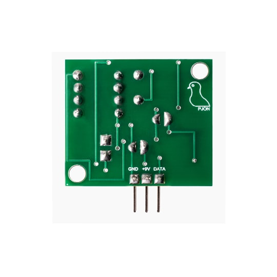

## PJ105


The PJ105 module is a 10x11.7mm open-source, stand-alone, programmable phto-resistor light sensor based on ATtiny85 with [PJON](https://github.com/gioblu/PJON/) over [PJDL](https://github.com/gioblu/PJON/blob/master/src/strategies/SoftwareBitBang/specification) networking. It needs only 3 pins (PJDL, 5v, GND) to operate transmitting samples and receiving incoming configuration on the same PJON IO pin.

```cpp  
 _______   _______   _______
|       | |       | |       |
| PJ105 | | PJ105 | | PJ105 |
|_______| |_______| |_______|
____|||_______|||_______|||______ SoftwareBitBang bus
_____||________||________||______ +9v
______|_________|_________|______ GND
```
Multiple PJ105s can be connected in parallel on the same [SoftwareBitBang](https://github.com/gioblu/PJON/tree/master/src/strategies/SoftwareBitBang) bus sharing the same power, ground and data connection. Each PJ105 is running an instance of the PJON protocol stack with its own configurable device id, so many can coexist on the same medium.

PJ105 has been engineered with the strong feeling that, in the future, "smart houses" will not necessarily host a multitude of inefficient embedded real-time operative systems in whatever "thing" while exposing vulnerabilities out of the physical boundaries of houses. Otherwise, more probably, will host many simple, less power-hungry microcontrollers, connected to a wired communication bus.

### Software
A basic example program is proposed to let users easily configure the PJ105s using only a series of commands on its PJON [SoftwareBitBang](https://github.com/gioblu/PJON/tree/master/src/strategies/SoftwareBitBang) bus to avoid flashing the chip multiple times. With the [Console](software/Console/Console.ino) example and an Arduino compatible device it is possible to input configuration and request samples with an easy to use console interface. PJ105 accepts incoming requests if sent by `PJON_MASTER_ID` and its configured recipient id.

| Command                          | Parameter     | Effect                                                            |
| -------------------------------- | --------------| ----------------------------------------------------------------- |
|  `?` Info                        | none          | Transmits module name and software version                        |
|  `E` Execute                     | none          | Reads the photo-resistor sensor and transmits sample              |
|  `M` Mode                        | `bool`        | Sets passive or active mode                                       |
|  `I` Device id                   | `uint8_t`     | Sets device id                                                    |
|  `R` Recipient device id         | `uint8_t`     | Sets recipient id                                                 |
|  `T` Transmission interval       | `uint16_t`    | Sets transmission interval                                        |
|  `Q` Configuration block         | none          | Blocks incoming configuration                                     |
|  `X` Configuration reset         | none          | Sets configuration to default                                     |

- `Q` For security reasons it is possible to block incoming configuration, although further configuration is possible flashing the [PJ105](software/PJ105/PJ105.ino) sketch on the ATtiny85 using an ISP programmer.

The ATtiny85 must to be flashed with the [PJ105](software/PJ105/PJ105.ino) sketch using an ISP programmer, see [ATtiny85 interfacing](https://github.com/gioblu/PJON/wiki/ATtiny-interfacing)

### Schematic
The circuit is quite simple and can be tested quickly on a breadboard. It is composed by few components such as the MCU, its clock, the voltage regulator, a couple of resistors, capacitors and obviously the MQ2 sensor.


### License
All software included in this repository is experimental and it is distributed "AS IS" without any warranty, use it at your own risk. [Licensed](https://github.com/gioblu/PJON/blob/master/LICENSE.md) under the Apache License, Version 2.0. PJON® and its brand are registered trademarks, property of PJON Technologies srl

### Safety warning
When installing or maintaining a PJON network, extreme care must be taken to avoid any danger. If devices are connected to AC power you are exposed to a high chance of being electrocuted if hardware is not installed carefully and properly. If you are not experienced enough ask the support of a skilled technician and consider that many countries prohibit uncertified installations. When a [SoftwareBitBang](https://github.com/gioblu/PJON/tree/master/src/strategies/SoftwareBitBang) bus is installed [interference mitigation](https://github.com/gioblu/PJON/wiki/Mitigate-interference) and [protective circuitry](https://github.com/gioblu/PJON/wiki/Protective-circuitry) guidelines must be followed. When working with an [AnalogSampling](https://github.com/gioblu/PJON/tree/master/src/strategies/AnalogSampling) LED or laser based setup safety glasses must be worn and transceivers must be operated cautiously to avoid potential eye injuries. When connecting a local bus to the internet all devices must be considered potentially compromised, manipulated or remotely actuated against your will. It should be considered a good practice not to connect to the internet systems that may create a damage (fire, flood, data-leak) if hacked.
